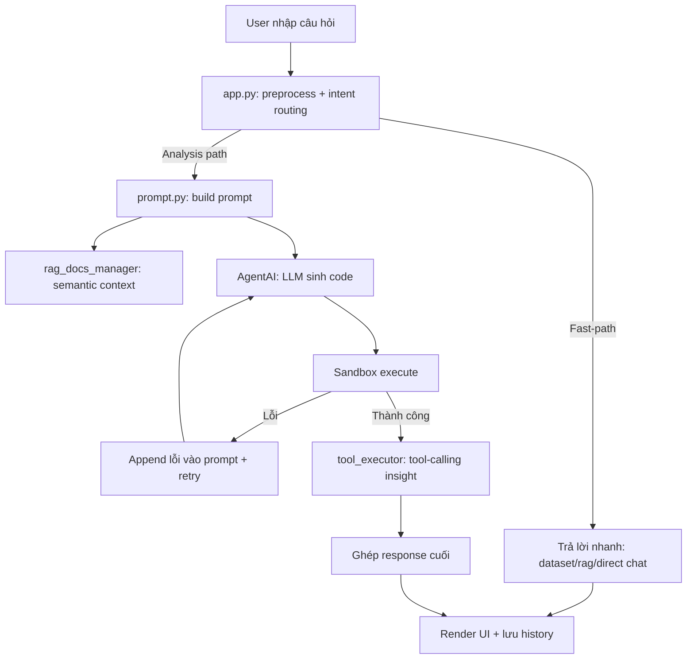

# Báo Cáo Kiến Trúc AI - AI-Datanalysis

## 1. Mục tiêu hệ thống

Ứng dụng là chatbot phân tích dữ liệu bất động sản, cho phép người dùng:

- Hỏi thông tin dataset (số dòng, cột, ý nghĩa cột).
- Yêu cầu vẽ biểu đồ và phân tích số liệu.
- Nhận insight tự động dựa trên dữ liệu thực và tài liệu ngữ cảnh.

Hệ thống kết hợp 4 cơ chế chính:

- **Intent routing** (định tuyến câu hỏi).
- **Prompt + Code Agent** (LLM sinh code và thực thi sandbox).
- **Semantic RAG** từ thư mục `rag_docs/`.
- **Tool-calling insight** để lấy số liệu chính xác từ DataFrame.

---

## 2. Thành phần kiến trúc chính

### 2.1 `app.py` (Orchestrator)

Vai trò:

- Điều phối toàn bộ vòng đời request chat.
- Quyết định đi luồng trả lời nhanh hay luồng sinh code.
- Gọi prompt builder, agent runtime, tool insight.
- Render kết quả lên UI và lưu history vào `st.session_state`.

### 2.2 `prompt.py` (Prompt Builder)

Vai trò:

- Xây dựng prompt cuối cho luồng phân tích.
- Đưa vào prompt:
  - metadata DataFrame (`df.info` + sample),
  - lịch sử câu hỏi user,
  - code template từ `ragdata/*.txt`,
  - context semantic từ `rag_docs/`.

### 2.3 `agent.py` (`AgentAI`)

Vai trò:

- Gọi LLM sinh code Python.
- Trích xuất code block và chạy trong sandbox có import whitelist.
- Retry nhiều vòng khi lỗi, kèm thông tin lỗi vào prompt để model tự sửa.

### 2.4 `rag_docs_manager.py` (Semantic RAG)

Vai trò:

- Index tài liệu từ `rag_docs/` vào ChromaDB.
- Tạo embedding và query theo similarity.
- Inject context vào prompt bằng thẻ `<rag_docs_context>`.

### 2.5 `tool_executor.py` (Tool-calling Engine)

Vai trò:

- Cho LLM gọi tool function để lấy số liệu chính xác.
- Thực thi tool và trả kết quả lại LLM theo vòng lặp.
- Sinh insight tiếng Việt ngắn gọn dựa trên kết quả tool.

---

## 3. Flow hoạt động tổng thể



---

## 4. Cụ thể hóa từng bước xử lý

## Bước 1 - Nhận input và chuẩn hóa ngữ cảnh

- Người dùng nhập câu hỏi qua `st.chat_input`.
- Hệ thống lưu câu hỏi vào `st.session_state.messages`.
- Nếu là câu follow-up ngắn sau câu hỏi chọn cột (ví dụ: `cột giá`), hệ thống rewrite thành yêu cầu phân tích rõ nghĩa để router hiểu đúng.

## Bước 2 - Phân loại intent

Hàm `should_answer_normally(...)` xác định:

- **Fast-path**:
  - greeting/help,
  - dataset overview,
  - context query (ý nghĩa cột),
  - direct chat.
- **Analysis-path**:
  - câu hỏi biểu đồ/thống kê/so sánh/ranking.

Nếu fast-path, hệ thống trả lời ngay không chạy code agent.

## Bước 3 - Build prompt cho luồng phân tích

`process_prompt(...)` trong `prompt.py` thực hiện:

- Trích metadata DataFrame (`info + sample`) để model biết schema dữ liệu.
- Lấy lịch sử câu hỏi user làm context định tuyến.
- Chọn `graph_type` và nạp template code từ thư mục `ragdata/`.
- Query semantic RAG từ `rag_docs/` và chèn vào prompt cuối.
- Đính kèm instruction ràng buộc output (`fig`, `analysis`, `result`).

## Bước 4 - LLM sinh code và chạy sandbox

`AgentAI.chat(prompt)`:

- Gọi LLM để sinh code Python.
- Trích code trong block ```python```.
- Thực thi bằng `exec` trong môi trường cách ly, có whitelist import.
- Trả về một trong các kiểu:
  - `dict` chứa `figure` + `analysis`,
  - `go.Figure`,
  - `str`,
  - hoặc lỗi.

## Bước 5 - Retry tự sửa lỗi

Nếu code lỗi:

- Agent thu traceback + loại lỗi.
- Chèn `<code_error>` và `<message_error>` vào prompt.
- Gọi lại LLM để sửa code.
- Lặp đến `MAX_ATTEMPTS`.

## Bước 6 - Tool-calling insight

Sau khi có kết quả chính:

- `run_tool_insight(...)` mở vòng function-calling qua Ollama.
- LLM được phép gọi các tool đăng ký trong `tools/`.
- Tool đọc DataFrame thật, trả số liệu thật.
- LLM tổng hợp insight ngắn gọn bằng tiếng Việt.
- Insight được ghép vào nội dung trả lời UI.

## Bước 7 - Trả kết quả và lưu phiên

- Render kết quả phù hợp:
  - figure + phân tích,
  - text,
  - hoặc lỗi thân thiện.
- Lưu message assistant vào session history.
- `st.rerun()` để cập nhật giao diện.

---

## 5. Luồng fast-path (không sinh code)

### 5.1 Dataset overview

- Trả số dòng, số cột, danh sách cột chính.

### 5.2 Context query qua RAG

- Query `rag_docs` để lấy ngữ cảnh tài liệu.
- Nếu similarity thấp, fallback top-1 doc để tránh context rỗng.
- LLM trả lời giải thích tự nhiên (không sinh code).

### 5.3 Direct chat

- Dùng LLM trả lời trực tiếp, không chạy agent code path.

---

## 6. Dữ liệu và bộ nhớ ngữ cảnh

Nguồn ngữ cảnh chính:

- **Data context**: DataFrame hardcoded (`vietnam_housing_dataset_cleaned.csv`).
- **Conversation context**: `st.session_state.messages`.
- **Code context**: `last_code` từ lần chạy trước.
- **Knowledge context**: `rag_docs/` đã index trong ChromaDB.

---

## 7. Cơ chế an toàn và ổn định

- Sandbox execution + module whitelist trong `AgentAI`.
- Retry loop có feedback lỗi giúp tăng tỉ lệ tự sửa.
- Timeout và error handling trong `tool_executor`.
- RAG fallback khi không đạt ngưỡng similarity.
- Fast-path cho câu hỏi đơn giản để giảm chi phí và độ trễ.

---

## 8. Tóm tắt kiến trúc

Hệ thống dùng mô hình lai:

- **Rule/LLM routing** để chọn luồng xử lý.
- **LLM code generation** để tạo biểu đồ/phân tích linh hoạt.
- **RAG** để bổ sung kiến thức mô tả cột/ngữ cảnh dữ liệu.
- **Tool-calling** để neo kết luận vào số liệu thực.

Kiến trúc này phù hợp cho bài toán chatbot phân tích dữ liệu vì cân bằng được:

- tính linh hoạt (LLM sinh code),
- tính đúng đắn (tool số liệu thật),
- và tính giàu ngữ cảnh (RAG + history).

